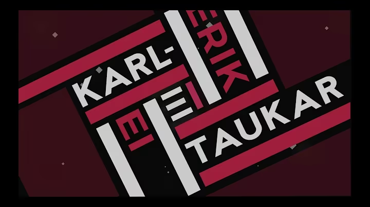

# [Karl-Erik Taukar - Ei (Нет)](https://www.youtube.com/watch?v=CWULMpE7Quk)

| Eesti                                              | Перевод |
|----------------------------------------------------|---------|
| Oli hämar tuba paksult rahvast täis                |         |
| Ja seal iga teine õnnelikum näis                   |         |
| Kuni silmanurgas sähvatus mul käis                 |         |
| Ja mu süda seisma jäi                              |         |
|                                                    |         |
| Nii ta peale takerdus mu põletav pilk              |         |
| Oma mõtteis sõnu lauseteks sidusin                 |         |
| Need siis järjest kõrva talle sosistasin           |         |
| Kuid ta pööras külmalt, ta pööras                  |         |
|                                                    |         |
| Ja ütles "Ei! Ma sinusugust seiklust ei vaja"      |         |
| Ta ütles "Ei!"                                     |         |
| See tänaseni meeltes mul kajab, meeltes mul kajab  |         |
|                                                    |         |
| Meie kohtumisest möödusid paar kuud                |         |
| Olin endamisi pikalt juurelnud                     |         |
| Kuni lõpuks jälle ristusid me teed                 |         |
| Olin kindlam endas veel                            |         |
|                                                    |         |
| Küll ta seekord sama viga enam ei tee              |         |
| Et annaks hinde ainult raamatu kannele             |         |
| Olin täpselt iga sõna harjutand veel               |         |
| Kuid ta vastas julmalt, ta vastas                  |         |
|                                                    |         |
| Ja ütles "Ei! Ma sinusugust seiklust ei vaja"      |         |
| Ta ütles "Ei!"                                     |         |
| See tänaseni meeltes mul kajab, meeltes mul kajab  |         |
|                                                    |         |
