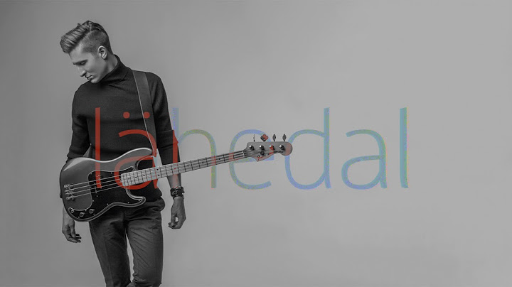

# [Karl-Erik Taukar - Lähedal (Рядом)](https://www.youtube.com/watch?v=b7I94lIcLZk)

| Eesti                                       | Перевод                                        |
|---------------------------------------------|------------------------------------------------|
| Silmad avan, iga hommik on sama             | Я открываю глаза, каждое утро одно и то же     |
| Läinud oled kui ma alles magan              | Ты ушла, пока я еще спал                       |
| Toas on jahe ja mul und enam pole           | В комнате прохладно, и спать больше не хочется |
| Koer kisub teki põrandale                   | Собака тянет на пол одеяло                     |
|                                             |                                                |
| Nii täna kui homme                          | И сегодня, и завтра                            |
| Ma ootan su samme, et nad tooksid sind koju | Я жду твои шаги, что приведут тебя домой       |
| See on siililgi selge, end liimiks su külge | Даже ежу понятно — что я бы прилип к тебе      |
| Ja et ootan sind koju                       | И что я жду тебя домой                         |
|                                             |                                                |
| Hommikuti asja must ei saa                  | По утрам ничего не получается                  |
| Kui sind pole lähedal, pole lähedal         | Когда тебя нет рядом, рядом нет                |
| Hommikuti asja must ei saa                  | По утрам ничего не выходит                     |
| Kui sind pole lähedal, pole lähedal         | Если тебя нет рядом, рядом нет                 |
|                                             |                                                |
| Lähedal, lä-lä-lähedal                      | Рядом, ря-ря-рядом                             |
| Lähedal, lä-lä-lähedal                      | Рядом, ря-ря-рядом                             |
| Lähedal, lä-lä-lähedal                      | Рядом, ря-ря-рядом                             |
| Lähedal, lä-lä-lähedal                      | Рядом, ря-ря-рядом                             |
|                                             |                                                |
| Sind on vaja igal pool, igal ajal           | Ты нужна всегда и везде                        |
| Põhjuseid on selleks üle saja               | На то больше сотни причин                      |
| Mul pole isu, miskit kaasa ei kisu          | У меня нет аппетита, ничто не привлекает       |
| Vahin filme, millel pole sisu               | Смотрю бессмысленные фильмы                    |
|                                             |                                                |

## Uus sõnavara

1. jahe, jaheda, jahedat - прохладный
2. uni, une, und - сон
3. kiskuma, kiskuda, kisub - дергать, рвать, тащить, притягивать, привлекать
4. tekk, teki, tekki - одеяло
5. siililegi selge - и ежу понятно, совершенно очевидно
6. liimima, liimida, liimib - клеить, заклеивать
7. külg, külje, külge - бок, сторона
8. isu, isu, isu - аппетит, желание
9. miski, millegi, midagi - что-то, нечто
10. vahtima, vahtida, vahib - смотреть, засматриваться, бездельничать
11. sisu, sisu, sisu - содержание, смысл

## Laused uute sõnadega

1. Mina pole sellega päriselt nõus. (Я с этим совершенно не согласен.)
2. Kui keegi teeb kasvõi sammu, lendame kõik vastu taevast. (Если кто-то сделает хоть шаг, мы все взлетим в воздух.)
3. Pidu venis ja mul tuli tahtmine varvast visata. (Вечеринка затянулась, и я почувствовал, что пора сваливать.)
4. Ära istu lahtise akna all! (Не сиди под открытым окном!)
5. Kümme lisakilo lennutasid mu kohe ülekaaluliste hulka. (Десять лишних килограммов сразу же отправили меня в группу людей с избыточным весом.)
6. Rebi salatilehed tükkideks ja lisa toidule. (Порвите на кусочки листья салата и добавьте в блюдо.)
7. Minu õhuke tekk ei pakkunud külmadel öödel kuigi palju sooja. (Тонкое одеяло не могло согреть меня холодными ночами.)
8. Laps on meie ihu ja veri. (Ребенок - это наша плоть и кровь.)
9. Mesi pani sõrmed kleepuma. (Мед склеил пальцы.)
10. Mees tundus neile pisut kahtlane. (Мужчина показался им слегка подозрительным.)
11. Teatud asjaolude sunnil ei saa ma kauem siin viibida. (Ввиду сложившихся обстоятельств я не могу здесь больше оставаться.)
12. Meie saatus on meie kätes. (Наша судьба в наших руках.)
13. Tuleb varuda kannatust. (Нужно запастись терпением.)
14. Killud toovad õnne. (Осколки приносят счастье.)
