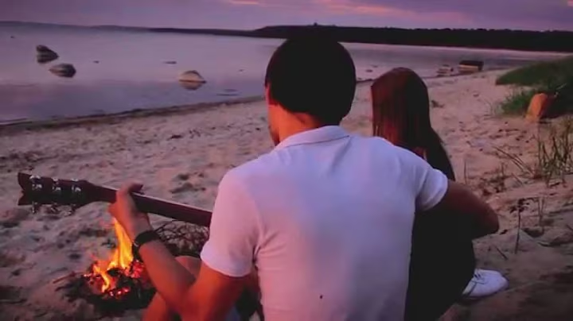

# [SHANON - Varbad liivas (Пальцы в песке)](https://www.youtube.com/watch?v=JXPEk9NHMpk)

| Eesti                                    | Перевод                                        |
|------------------------------------------|------------------------------------------------|
| Meil kõigil olnud on aegu                | У всех нас были времена                        |
| Kui veel                                 | Когда еще                                      |
| Nii täpselt ei tea...                    | Точно не знаешь...                             |
| Ja enne aru ei saa                       | И пока не понимаешь                            |
| Kui on läind                             | Пока не пройдет                                |
| See mis on hea...                        | Что-то хорошее...                              |
|                                          |                                                |
| Ma enne sind ei oleks uskunud            | До нашей встречи я бы не поверил               |
| Et päriselt                              | Что и правда                                   |
| Võib olla nii                            | Бывает так                                     |
| Ma sinu pärast sõidaksin                 | Я за тобой поехал бы                           |
| Kasvõi maailma otsa                      | Хоть не край света                             |
|                                          |                                                |
| Varbad liivas vaadates kuud              | Утопив пальцы в песок я смотрю на луну         |
| Su lahtiseid juukseid                    | Твои распущенные волосы                        |
| Lennutab tuul                            | Развеваются на ветру                           |
| Siin pilvede all pole vajagi midagi muud | Здесь под облаками больше ничего и не нужно    |
|                                          |                                                |
| Su rebitud teksad ja õhuke pluus         | Твои порванные джинсы и легкая блузка          |
| On ihule kleepund                        | К телу прилипли                                |
| Sest pisut on kuum                       | Поскольку немного жарко                        |
| Loodan vaid et viibib hommikutund        | Надеюсь лишь, что задержится этот утренний час |
|                                          |                                                |
| Mis saatusel varuks on meile             | Что приготовила нам судьба                     |
| Sel teel                                 | На этом пути                                   |
| Me täpselt ei tea...                     | Мы не знаем точно...                           |
| Kas killud toovadki õnne                 | Принесут ли мгновения счастье                  |
| Kui jah -                                | И если да -                                    |
| Kas halba või head...                    | То во благо или на беду                        |
|                                          |                                                |
| Siin mererannal soojast suveööst         | От этой теплой летней ночи на морском берегу   |
| Me võtame                                | Мы берем                                       |
| Kõik mis võtta on                        | Все, что можем                                 |
| Ma luban kanda kätel sind                | Я обещаю отнести тебя на руках                 |
| Kasvõi maailma otsa                      | Хоть на край света                             |

## Uus sõnavara

1. päriselt - совершенно, в самом деле
2. kasvõi - хоть, даже
3. varvas, varba, varvast - палец (на ноге)
4. lahtine, lahtise, lahtist - открытый, распущенный
5. lennutama, lennutada, lennutab - запускать, бросать
6. rebima, rebida, rebib - рвать, разрывать
7. õhuke, õhukese, õhukest - тонкий, легкий, воздушный
8. ihu, ihu, ihu - тело, плоть
9. kleepuma, kleepuda, kleepub - прилипать, липнуть
10. pisut - немного, чуть-чуть
11. viibima, viibida, viibib - задерживаться, оставаться, пребывать
12. saatus, saatuse, saatust - судьба
13. varuma, varuda, varub - запасать, готовить
14. kild, killu, kildu - осколок, кусочек

## Laused uute sõnadega

1. Mina pole sellega päriselt nõus. (Я с этим совершенно не согласен.)
2. Kui keegi teeb kasvõi sammu, lendame kõik vastu taevast. (Если кто-то сделает хоть шаг, мы все взлетим в воздух.)
3. Pidu venis ja mul tuli tahtmine varvast visata. (Вечеринка затянулась, и я почувствовал, что пора сваливать.)
4. Ära istu lahtise akna all! (Не сиди под открытым окном!)
5. Kümme lisakilo lennutasid mu kohe ülekaaluliste hulka. (Десять лишних килограммов сразу же отправили меня в группу людей с избыточным весом.)
6. Rebi salatilehed tükkideks ja lisa toidule. (Порвите на кусочки листья салата и добавьте в блюдо.)
7. Minu õhuke tekk ei pakkunud külmadel öödel kuigi palju sooja. (Тонкое одеяло не могло согреть меня холодными ночами.)
8. Laps on meie ihu ja veri. (Ребенок - это наша плоть и кровь.)
9. Mesi pani sõrmed kleepuma. (Мед склеил пальцы.)
10. Mees tundus neile pisut kahtlane. (Мужчина показался им слегка подозрительным.)
11. Teatud asjaolude sunnil ei saa ma kauem siin viibida. (Ввиду сложившихся обстоятельств я не могу здесь больше оставаться.)
12. Meie saatus on meie kätes. (Наша судьба в наших руках.)
13. Tuleb varuda kannatust. (Нужно запастись терпением.)
14. Killud toovad õnne. (Осколки приносят счастье.)
