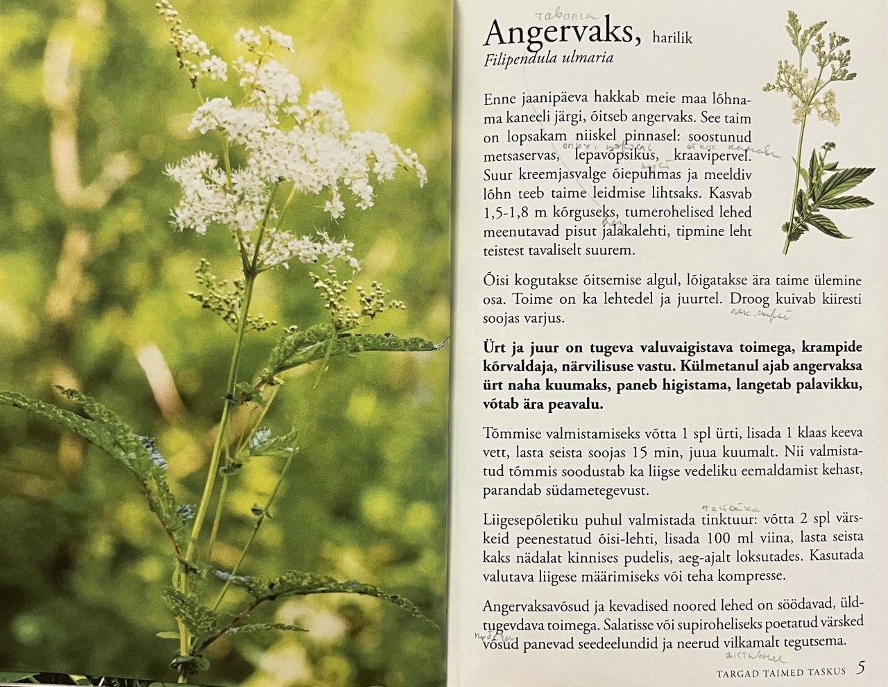

# Angervaks, harilik (Таволга обыкновенная)

## Filipendula ulmaria (Таволга вязолистная)

Enne jaanipäeva hakkab meie maa lõhnama kaneeli järgi (корицей), õitseb (цветет) angervaks. See taim on lopsakam (более пышный) niiskel (на влажной) pinnasel (почве): soostunud (заболоченной) metsaservas (окраина леса), lepavõpsikus (в зарослях ольхи), kraavipervel (на склоне канавы). Suur kreemjasvalge õiepuhmas (соцветие, плотное спопление цветков) ja meeldiv lõhn teeb taime leidmise lihtsaks. Kasvab 1,5 - 1,8 m kõrguseks, tumerohelised lehed meenutavad (напоминают) pisut (немного) jalakalehti (листья вяза), tipmine (верхний) leht teistest tavaliselt suurem.

Õisi kogutakse (собирают) õitsemise algul, lõigatakse ära (отрезают) taime ülemine (верхнюю) osa. Toime (эффект) on ka lehtedel ja juurtel (корней). Droog (растение, лекарственное сырье) kuivab (сохнет) kiiresti soojas varjus (в тепле и тени).

Ürt (трава) ja juur on tugeva valuvaigistava (обезболивающим) toimega (эффектом), krampide (судороги) kõrvaldaja (устранять), närvilisuse (нервозность, раздражительность) vastu (против). Külmetanul (при простуде) ajab (гнать, вызывать) angervaksa ürt naha (кожу) kuumaks, paneb (заставляет) higistama (потеть), langetab (снижает) palavikku (температуру), võtab ära peavalu.

Tõmmise (экстракт) valmistamiseks võtta 1 spl ürti (целебная трава), lisada 1 klaas keeva (кипящей) vett, lasta (дайте) seista soojas 15 min, juua kuumalt. Nii valmistatud tõmmis soodustab (способствует) ka liigse (избыточный) vedeliku (жидкость) eemaldamist (удаление) kehast, parandab (восстанавливает) südametegevust (сердечная деятельность).

Liigesepõletiku (артрит) puhul (в случае) valmistada tinktuur (настойку): võtta 2 spl värskeid peenestatud (измельчать) õisi-lehti, lisada 100 ml viina, lasta seista kaks nädalat kinnises pudelis, aeg-ajalt loksutades (взбалтывая). Kasutada valutava (больной) liigese (сустав) määrimiseks (смазывать) või teha kompresse.

Angervaksavõsud (побеги) ja kevadised noored lehed on söödavad (съедобны), üldtugevdava (общеукрепляющий) toimega. Salatisse või supiroheliseks (столовая зелень) poetatud (добавленные) värsked võsud panevad seedeelundid (пищеварительный орган) ja neerud (почки) vilkamalt (активней) tegutsema (работать).

Перед Ивановым днем наша земля начинает пахнуть корицей, цветет таволга обыкновенная. Это растение растет лучше во влажной почве: на заболоченной опушке леса, в зарослях ольхи, на склоне канавы. Большое кремово-белое соцветие и приятный запах делают его поиск несложным. Вырастающие до 1,5 - 1,8 метров в высоту темно-зеленые листья немного напоминают листья вяза, верхний обычно больше остальных.

## Uus sõnavara

1. kaneel, kaneeli, kaneeli - корица
2. õitsema, õitseda, õitseb - цвести
3. lopsakas, lopsaka, lopsakat - пышный
4. niiske, niiske, niisket - влажный, сырой
5. pinnas, pinnase, pinnast - почва
6. soostuma, soostuda, soostub - заболачиваться
7. metsaserv, metsaserva, metsaserva - лесная опушка, окраина леса
8. lepp, lepa, leppa - ольха
9. võpsik, võpsiku, võpsikut - заросли, кустарник
10. kraav, kraavi, kraavi - канава
11. perv, perve, pervet - склон, обочина
12. ois, oie, oit - цветок
13. puhm, puhma, puhma - кустарник
14. õiepuhmas, õiepuhma, õiepuhmast - соцветие, плотное скопление цветков
15. meenutama, meenutada, meenutab - напоминать
16. pisut - немного, чуть-чуть
17. jalakas, jalaka, jalakat - вяз
18. tipmine, tipmise, tipmist - верхний
19. koguma, koguda, kogub - собирать
20. ülemine, ülemise, ülemist - верхний
21. toime, toime, toimet - эффект, действие
22. juur, juure, juurt - корень
23. droog, droogi, droogi - растение, лекарственное сырье
24. vari, varju, varju - тень
25. ürt, ürdi, ürti - целебная трава
26. vaigistama, vaigistada, vaigistab - успокаивать, утолять
27. toime, toime, toimet - эффект, действие
28. kramp, krambi, krampi - судорога
29. kõrvaldama, kõrvaldada, kõrvaldab - устранять
30. närvilisus, närvilisuse, närvilisust - нервозность, раздражительность
31. külmetama, külmetada, külmetab - замерзать, простужаться
32. ajama, ajada, ajab - гнать, вызывать
33. nahk, naha, nahka - кожа
34. higistama, higistada, higistab - потеть
35. langetama, langetada, langetab - снижать
36. tõmmis, tõmmise, tõmmist - экстракт
37. keev, keeva, keevat - кипящий, кипяток
38. soodustama, soodustada, soodustab - способствовать
39. liigne, liigse, liigset - избыточный
40. vedelik, vedeliku, vedelikku - жидкость
41. eemaldama, eemaldada, eemaldab - удалять
42. südametegevus, südametegevuse, südametegevust - сердечная деятельность
43. liiges, liigese, liigest - сустав
44. põletik, põletiku, põletikku - воспаление
45. puhk, puhu, puhku - раз, случай
46. tinktuur, tinktuuri, tinktuuri - настойка
47. peenestama, peenestada, peenestab - измельчать
48. loksutama, loksutada, loksutab - взбалтывать
49. määrima, määrida, määrib - смазывать
50. võsu, võsu, võsu - побег
51. söödav, söödava, söödavat - съедобный
52. üldtugevdav, üldtugevdava, üldtugevdavat - общеукрепляющий
53. poetama, poetada, poetab - добавлять, класть
54. seedeelund, seedeelundi, seedeelundit - пищеварительный орган
55. neer, neeru, neeru - почка
56. vilgas, vilka, vilgast - живой, активный, энергичный
