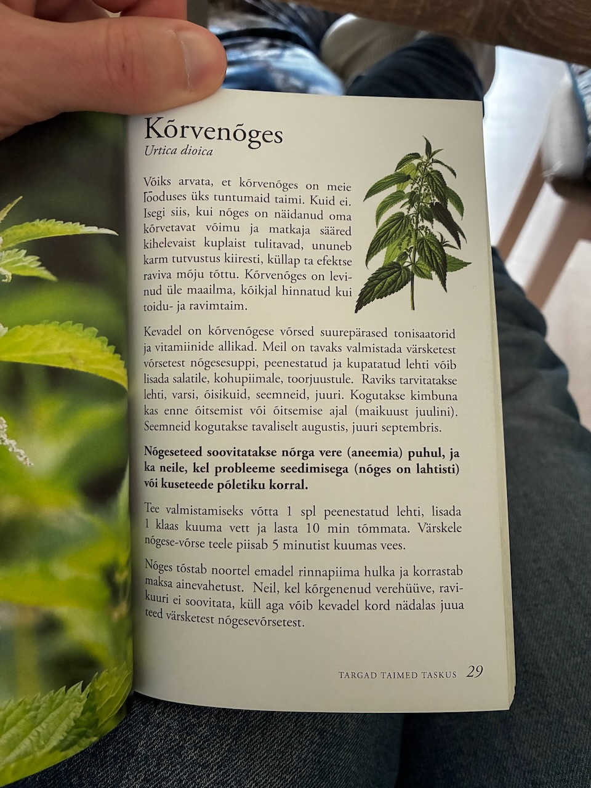

# Kõrvenõges (Крапива)

## Urtica dioica (Крапива двудомная)

Võiks arvata, et kõrvenõges on meie looduses üks tuntumaid taimi. Kuid ei. Isegi siis, kui nõges on näidanud oma kõrvetavat võimu ja matkaja sääred kihelevaist kuplaist tulitavad, ununeb karm tutvustus kiiresti, küllap ta efektse raviva mõju tõttu. Kõrvenõges on levinud üle maailma, kõikjal hinnatud kui toidu- ja ravimtaim.

Kevadel on kõrvenõgese võrsed suurepärased tonisaatorid ja vitamiinide allikad. Meil on tavaks valmistada värsketest võrsetest nõgesesuppi, peenestatud ja kupatatud lehti võib lisada salatile, kohupiimale, toorjuustule. Raviks tarvitatakse lehti, varsi, õisikuid, seemneid, juuri. Kogutakse kimbuna kas enne õitsemist või õitsemise ajal (maikuust juulini). Seemneid kogutakse tavaliselt augustis, juuri septembris.

Nõgeseteed soovitatakse nõrga vere (aneemia) puhul, ja ka neile, kel probleeme seedimisega (nõges on lahtisti) või kuseteede põletiku korral.

Tee valmistamiseks võtta 1 spl peenestatud lehti, lisada 1 klaas kuuma vett ja lasta 10 min tõmmata. Värskele nõgese-võrse teele piisab 5 minutist kuumas vees.

Nõges tõstab noortel emadel rinnapiima hulka ja korrastab maksa ainevahetust. Neil, kel kõrgenenud verehüüve, ravikuuri ei soovitata, küll aga võib kevadel kord nädalas juua teed värsketest nõgesevõrsetest.

## Uus sõnavara

