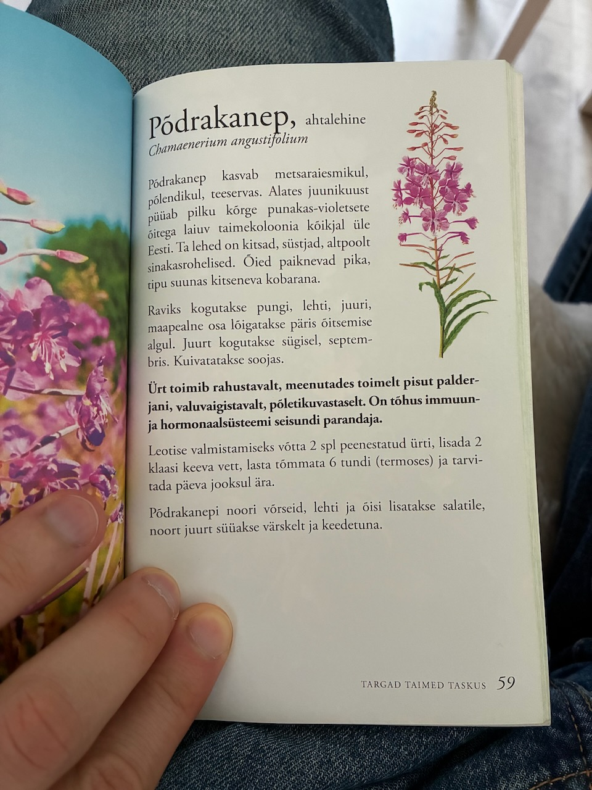

# Põdrakanep, ahtalehine (Кипрей / Иван-чай, узколистный)

## Chamaenerium angustifolium (Кипрей узколистный)

Põdrakanep kasvab metsaraiesmikul, põlendikul, teeservas. Alates juunikuust püüab pilku kõrge punakas-violetsete õitega laiuv taimekoloonia kõikjal üle Eesti. Ta lehed on kitsad, süstjad, altpoolt sinakasrohelised. Õied paiknevad pika, tipu suunas kitseneva kobarana.

Raviks kogutakse pungi, lehti, juuri, maapealne osa lõigatakse päris õitsemise algul. Juurt kogutakse sügisel, septembris. Kuivatatakse soojas.

Ürt toimib rahustavalt, meenutades toimelt pisut palderjani, valuvaigistavalt, põletikuvastaselt. On tõhus immuun- ja hormonaalsüsteemi seisundi parandaja.

Leotise valmistamiseks votta 2 spl peenestatud ürti, lisada 2 klaasi keeva vett, lasta tõmmata 6 tundi (termoses) ja tarvitada päeva jooksul ära.

Põdrakanepi noori võrseid, lehti ja õisi lisatakse salatile, noort juurt süüakse värskelt ja keedetuna.

## Uus sõnavara

1. põdrakanep, põdrakanepi, põdrakanepit - кипрей, иван-чай
2. metsaraie, metsaraie, metsaraiet - вырубка леса
3. põlendik, põlendiku, põlendikku - выжженное место, пепелище
4. teeserv, teeserva, teeserva - обочина дороги
5. püüdma, püüda, püüab - ловить, привлекать внимание
6. pilk, pilgu, pilku - взгляд
7. punakas, punaka, punakat - красноватый
8. violetne, violetse, violetset - фиолетовый
9. õis, õie, õit - цветок
10. laiuma, laiuda, laiub - распространяться, раскидываться
11. kitsas, kitsa, kitsast - узкий
12. süstjas, süstja, süstjat - веретенообразный
13. altpoolt - снизу, с нижней стороны
14. sinakasroheline, sinakasrohelise, sinakasrohelist - синевато-зеленый
15. paiknema, paikneda, paikneb - располагаться, находиться
16. tipp, tipu, tippu - верхушка, вершина
17. suund, suuna, suunda - направление
18. kitsenema, kitseneda, kitseneb - сужаться, становиться уже
19. kobar, kobara, kobarat - гроздь, соцветие
20. ravi, ravi, ravi - лечение, терапия
21. pung, punga, punga - бутон
22. maapealne, maapealse, maapealset - надземный
23. toimima, toimida, toimib - действовать
24. rahustama, rahustada, rahustab - успокаивать
25. meenutama, meenutada, meenutab - напоминать
26. toime, toime, toimet - эффект, действие
27. pisut - немного, чуть-чуть
28. palderjan, palderjani, palderjani - валериана
29. vaigistama, vaigistada, vaigistab - успокаивать, утолять
30. põletikuvastane, põletikuvastase, põletikuvastast - противовоспалительный
31. tõhus, tõhusa, tõhusat - эффективный
32. seisund, seisundi, seisundit - состояние
33. leotis, leotise, leotist - настой, экстракт
34. peenestama, peenestada, peenestab - измельчать, мелко резать
35. keev, keeva, keevat - кипящий
36. tõmbama, tõmmata, tõmbab - настаивать
37. tarvitama, tarvitada, tarvitab - употреблять, использовать
38. võrse, võrse, võrset - побег
39. keetma, keeta, keedab - варить
